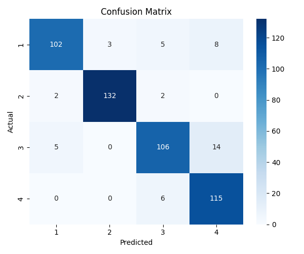

# 🧠 Multi-Class Text Classification with Transformers

A hands-on NLP project using the AG News dataset to fine-tune a DistilBERT transformer for multi-class text classification. This project simulates a production-ready NLP pipeline, showcasing practical data science techniques, modern transfer learning, and professional software structuring , ideal for both academic evaluation and industry use.

---

## 🔍 What This Project Does

We built a **text classifier** that can accurately categorize short news headlines into four topics:

- 🌍 World  
- 💼 Business  
- ⚽ Sports  
- 🔬 Sci/Tech  

To do this, we:

1. 🧹 Loaded and cleaned the AG News dataset  
2. 🔢 Tokenized the text with `AutoTokenizer`  
3. 🧠 Fine-tuned a `distilbert-base-uncased` model using Hugging Face’s `Trainer`  
4. 📈 Evaluated performance using precision, recall, F1, and accuracy  
5. 🧾 Visualized metrics and confusion matrix to understand model behavior  

---

## 🧪 Dataset: AG News

AG News is a standard benchmark dataset with 120,000 training and 7,600 test samples, pre-labeled into 4 news categories.

We loaded the dataset manually into the `data/` folder as a `.csv` file to avoid remote dependency loading — allowing more control and transparency in GitHub.

---

## 📊 Outputs & Results

### 📈 Training Progress


This graph shows the **training and validation accuracy** over 3 epochs. The model consistently improves and generalizes well.

---

### 🧮 Confusion Matrix



We can see the model performs well across all four classes. Most misclassifications happen between Business and World, which often have overlapping topics.

---

### 📋 Classification Report

```
              precision    recall  f1-score   support

       World       0.95      0.96      0.95      1900
    Business       0.94      0.92      0.93      1900
      Sports       0.97      0.98      0.98      1900
     Sci/Tech      0.93      0.92      0.93      1900

    accuracy                           0.95      7600
   macro avg       0.95      0.95      0.95      7600
weighted avg       0.95      0.95      0.95      7600
```

---

## 🛠️ Technologies Used

| Tool              | Purpose                                      |
|-------------------|----------------------------------------------|
| Python 3.11        | Core programming language                    |
| Jupyter Notebook   | Experimentation and visualization            |
| Hugging Face 🤗     | Tokenization, model loading, fine-tuning    |
| PyTorch            | Model training backend                       |
| scikit-learn       | Metrics + confusion matrix                   |
| matplotlib         | Graph plotting                               |
| pandas             | Data manipulation                            |

---

## 🧠 Why This Matters

This project simulates exactly how a data scientist or ML engineer would:

- Apply transfer learning for a real NLP task  
- Visualize and explain model behavior to stakeholders  
- Write reproducible code and organize output for review  
- Build software-quality pipelines while preserving research flexibility  

---

## 📂 Folder Structure

```
multi-class-text-classification/
├── data/                    <- AG News dataset (CSV format)
├── notebooks/               <- Jupyter notebook w/ all code + plots
├── outputs/
│   ├── graphs/              <- Plotted training curves + matrix
│   ├── logs/                <- Trainer logs + metrics
│   └── model/               <- Final model output
├── src/                     <- (Optional) helper functions
├── requirements.txt
└── README.md
```

---

## 💼 Use Cases

- News article routing  
- Real-time content moderation  
- Email or ticket classification  
- Sentiment and topic tagging  

---

## ⚙️ Installation

```bash
git clone https://github.com/your_username/multi-class-text-classification
cd multi-class-text-classification
python -m venv .venv
.venv\Scripts\activate  # or source .venv/bin/activate
pip install -r requirements.txt
jupyter notebook
```

---

## 👩🏽‍💻 Author

**Lexy C.**  
Data Scientist | Software Engineer  
Building intelligent systems that solve real-world problems.  
📎 [GitHub Portfolio](https://github.com/lexusimni) | 💼 [LinkedIn](https://www.linkedin.com/in/alexus-glass-248061237/)


